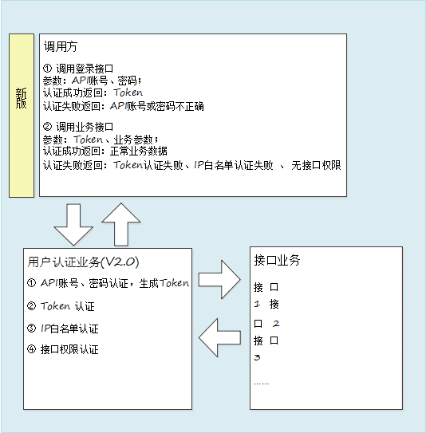

<!--
 * @Description: 
 * @Author: 谢永红
 * @Date: 2020-05-14 12:29:52
 * @LastEditors: Please set LastEditors
 * @LastEditTime: 2020-05-14 13:33:11
 -->
# 天巡开放平台

## 演示Demo
- [在线访问](./index.html)

- 视频服务：

- 客户代码：

- 终端号：

## 概述
天巡开放平台整合了道路货运行业内重型载货汽车的全量数据。在基于 500 万+重载货运车辆的大数据基础上、经过数据清洗、整合、处理后，开放提供多维度、多层次的车辆数据供用户在道路货运相关业务场景中使用。   
天巡开放平台 API 服务目前已为物流、金融、交通、保险、政府、车厂六大领域全面放开数据，开放的接口覆盖：位置信息、报警数据、信息验证、事件通知、辅助工具六大类。

## 适用对象
本文档适用于期望应用智运数据开放平台做各种数据业务应用的相关工作人员。

## 
术语和定义
- `https`
HTTPS（全称：Hyper Text Transfer Protocol over Secure Socket Layer），是以安全为目标的 HTTP 通道，简单讲是 HTTP 的安全版。即 HTTP 下加入 SSL 层，HTTPS 的安全基础是SSL，因此加密的详细内容就需要 SSL。 它是一个 URI scheme（抽象标识符体系），句法类同http:体系。用于安全的 HTTP 数据传输。
- `SDK`（软件开发工具包）
软件开发工具包（外语首字母缩写：SDK、外语全称：Software Development Kit）一般都是一些软件工程师为特定的软件包、软件框架、硬件平台、操作系统等建立应用软件时的开发工具的集合。

## 接口联调流程
API 接口通过 https 方式对外提供接口服务，遵循 API 接口规范，发送 https 请求，支持POST，数据交换接口将验证 API 用户的合法性和安全性，然后提供接口服务，接口数据采用UTF-8 格式编码。
1. `获取账密`
由你方商务人员向我方商务人员发起申请，申请成功后将为您提供调用接口所需的 `API 账号`、`密码`、`私钥`及`客户端 ID `信息。 
2. `编写接口`  
编写调用 API 接口的客户端代码，按照接口定义的 https 调用方式及传输转换后的参数进行调用，调用示例代码详见附录 B 及调用示例工程。 
3. `联调测试`  
联调测试环境域名为：，请根据文档中的示例参数或示例程序进行联调，联调环境为非正式数据，需使用我方指定的参数进行联调。接口调用成功且返回数据可正常解析后，表示联调成功。

## 技术要求
### 接口调用方式
API 接口通过 https 方式对外提供接口服务，遵循 API 接口规范，发送 https 请求，支持POST，数据交换接口将验证 API 用户的合法性和安全性，然后提供接口服务，接口数据采用UTF-8 格式编码。


- 用户登录接口获取token


请求地址 [http://smartsafety.aidriving.com/VsOpenAPI/user/userLogin](#)

参数列表
| 参数说明       | 参数说明              | 类型     | 是否必选 |
| -------------- | --------------------- | -------- | -------- |
| `userName`     | 账号                  | `String` | 是       |
| `password`     | 密码                  | `String` | 是       |
| `versionPhone` | 手机当前的android版本 | `String` |          |
| `phoneModel`   | 手机型号              | `String` |          |
| `appId`        | APP唯一号             | `String` |          |

返回参数
``` js
{
  "code": 1000,
  "message": "成功",
  "data": {
    "userId": 1,
    "userName": "",
    "company": "",
    "token": "",
    "password": "",
    "companyId": 1,
    "expiresTime": 1
  },
  "flag": false
}
```

返回参数列表
| 参数说明      | 类型      | 初始值 | 简介          |
| ------------- | --------- | ------ | ------------- |
| `flag`        | `Boolean` |        | 是否成功      |
| `code`        | `Number`  | 1000   | 返回码        |
| `data`        | `Object`  |        | 返回内容      |
| `message`     | `String`  |        | 返回信息      |
| `userId`      | `Number`  |        | 用户id        |
| `userName`    | `String`  |        | 用户名        |
| `password`    | `String`  |        | 密码          |
| `company`     | `String`  |        | 所属企业      |
| `token`       | `String`  |        | Token         |
| `companyId`   | `Number`  |        | 所属企业Id    |
| `expiresTime` | `Number`  |        | token失效周期 |

- 获取用户下所有的车

请求地址 [http://smartsafety.aidriving.com/VsOpenAPI/vehicle/addVehicleInfo](#)

## 接口说明 (默认post请求)
### 车辆基本信息
- 添加车辆信息

请求地址 [http://smartsafety.aidriving.com/VsOpenAPI/vehicle/addVehicleInfo](#)

参数列表
| 参数说明          | 参数说明      | 类型     | 是否必选 |
| ----------------- | ------------- | -------- | -------- |
| `token `          | 令牌          | `String` | 是       |
| `plateNo`         | 车牌号        | `String` | 是       |
| `plateColor`      | 车牌颜色      | `String` | 是       |
| `depId`           | 所属部门      | `String` | 是       |
| `region`          | 车籍地        | `String` |          |
| `industry`        | 行业类型      | `String` |          |
| `vehicleType`     | 车辆类型      | `String` |          |
| `carryCapacity`   | 载重          | `Number` |          |
| `vehLength`       | 车辆长        | `Number` |          |
| `vehWidth`        | 车辆宽        | `Number` |          |
| `vehHeight`       | 车辆高        | `Number` |          |
| `runStatus`       | 运行状态      | `String` |          |
| `termType`        | 终端类型      | `String` |          |
| `simNo`           | 终端卡号      | `String` |          |
| `termId`          | 绑定终端      | `Number` |          |
| `termNo`          | 唯一终端号    | `String` |          |
| `termState`       | 设备状态      | `String` |          |
| `installTime`     | 安装时间      | `String` |          |
| `videoChannelNum` | 视频通道数	Nu | `mber` ` |          |


返回参数
``` js
{
  "flag": false,
  "code": 1000,
  "message": "",
  "data": ""
}
```

返回参数列表
| 参数说明      | 类型                          | 初始值 | 简介                     |
| ----------------- | ----------------- | -------------- | ------------ |
| `flag`                | `Boolean` |                            | 是否成功 |
| `code`                | `Number`      | 1000           | 返回码           |
| `message` | `String`      | 成功           | 返回信息 |
| `data`                | `string`      |                                | 返回内容 |

- 获取用户下所有的车

请求地址 [http://smartsafety.aidriving.com/VsOpenAPI/vehicle/getAllVehicleInfo](#)

参数列表
| 参数说明 | 参数说明 | 类型     | 是否必选 |
| -------- | -------- | -------- | -------- |
| `token`  | 令牌     | `String` | 是       |
| `userid` | 用户id   | `String` | 是       |

返回参数
``` js
{
  "flag": true,
  "code": 1000,
  "message": "",
  "data": [
    {
      "plateNo": "",
      "onlineStatus": "",
      "lastDate": "",
	 "createDate": "",
 	"vehicleId": ""

    }
  ]
}
```

返回参数列表
| 参数说明       | 类型      | 初始值 | 简介         |
| -------------- | --------- | ------ | ------------ |
| `flag`         | `Boolean` |        | 是否成功     |
| `code`         | `Number`  | 1000   | 返回码       |
| `message`      | `String`  | 成功   | 返回信息     |
| `data`         | `string`  |        | 返回内容     |
| `plateNo`      | `String`  |        | 车牌号       |
| `onlineStatus` | `number`  |        | 在线状态     |
| `lastDate`     | `String`  |        | 最后在线时间 |
| `createDate`   | `String`  |        | 创建时间     |
| `vehicleId`    | `number`  |        | 车辆id       |


- 根据车辆id查询

请求地址 [http://smartsafety.aidriving.com/VsOpenAPI/vehicle/getVehicleInfoByVehicleId](#)

参数列表
| 参数说明    | 参数说明 | 类型     | 是否必选 |
| ----------- | -------- | -------- | -------- |
| `token`     | 令牌     | `String` | 是       |
| `vehicleId` | 车辆id   | `Number` | 是       |

返回参数
``` js
{
  "flag": false,
  "code": "",
  "message": "",
  "data": [
    {
      "industry": "",
      "region": "",
      "vehicleType": "",
      "plateColor": "",
      "simNo": "",
      "runStatus": "",
      "depId": "",
      "plateNo": "",
      "carryCapacity": 1,
      "vehLength": 1,
      "vehWidth": 1,
      "vehHeight": 1,
      "termType": "",
      "termId": 1,
      "termNo": "",
      "termState": "",
      "installTime": "",
      "videoChannelNum": 1
    }
  ]
}
```

返回参数列表
| 参数说明          | 类型      | 初始值 | 简介       |
| ----------------- | --------- | ------ | ---------- |
| `flag`            | `Boolean` |        | 是否成功   |
| `code`            | `Number`  | 1000   | 返回码     |
| `message`         | `String`  | 成功   | 返回信息   |
| `data`            | `string`  |        | 返回内容   |
| `plateNo`         | `String`  |        | 车牌号     |
| `plateColor`      | `String`  |        | 车牌颜色   |
| `depId`           | `String`  |        | 车辆组     |
| `industry`        | `String`  |        | 行业类型   |
| `region`          | `String`  |        | 车籍地     |
| `vehicleType`     | `String`  |        | 车辆类型   |
| `carryCapacity`   | `Number`  |        | 载重       |
| `vehLength`       | `Number`  |        | 车辆长     |
| `vehWidth`        | `Number`  |        | 宽         |
| `vehHeight`       | `Number`  |        | 高         |
| `runStatus`       | `String`  |        | 运行状态   |
| `simNo`           | `String`  |        | 终端卡号   |
| `termType`        | `String`  |        | 终端类型   |
| `termId`          | `Number`  |        | 绑定终端   |
| `termNo`          | `String`  |        | 唯一终端号 |
| `termState`       | `String`  |        | 终端状态   |
| `installTime`     | `String`  |        | 安装时间   |
| `videoChannelNum` | `Number`  |        | 视频通道数 |


- 根据车辆id修改车辆信息

请求地址 [http://smartsafety.aidriving.com/VsOpenAPI/vehicle/updateVehicleById](#)

参数列表
| 参数说明          | 参数说明   | 类型     | 是否必选 |
| ----------------- | ---------- | -------- | -------- |
| `Token（head）`   | 令牌       | `String` | 是       |
| `vehicleId`       | 车辆id     | `Number` | 是       |
| `plateNo`         | 车牌号     | `String` | 是       |
| `plateColor`      | 车牌颜色   | `String` | 是       |
| `depId`           | 车辆组     | `String` | 是       |
| `industry`        | 行业类型   | `String` |          |
| `region`          | 车籍地     | `String` |          |
| `vehicleType`     | 车辆类型   | `String` |          |
| `carryCapacity`   | 载重       | `Number` |          |
| `vehLength`       | 车辆长     | `Number` |          |
| `vehWidth`        | 宽         | `Number` |          |
| `vehHeight`       | 高         | `Number` |          |
| `runStatus`       | 运行状态   | `Number` |          |
| `simNo`           | 终端卡号   | `Number` |          |
| `termType`        | 终端类型   | `Number` |          |
| `termId`          | 绑定终端   | `Number` |          |
| `termNo`          | 唯一终端号 | `Number` |          |
| `termState`       | 终端状态   | `Number` |          |
| `installTime`     | 安装时间   | `Number` |          |
| `videoChannelNum` | 视频通道数 | `Number` |          |


返回参数
``` js
{
  "flag": false,
  "code": 1000,
  "message": "",
  "data": ""
}
```

返回参数列表
| 参数说明 | 类型 | 初始值 | 简介 |
| ------- | ------- | ---- | ------- |
| `flag` | `Boolean` |   | 是否成功 |
| `code` | `Number` | 1000 | 返回码 |
| `message` | `String` | 成功 | 返回信息 |
| `data` | `string` |  | 返回内容 |

- 根据车辆id删除车辆信息

请求地址 [http://smartsafety.aidriving.com/VsOpenAPI/vehicle/updateVehicleById](#)

参数列表
| 参数说明        | 参数说明   | 类型     | 是否必选 |
| --------------- | ---------- | -------- | -------- |
| `Token（head）` | 令牌       | `String` | 是       |
| `vehicleIdList` | 车辆id集合 | `Array`  | 是       |
| `vehicleId`     | 车辆id     | `Number` | 是       |


返回参数
``` js
{
  "flag": false,
  "code": 1000,
  "message": "",
  "data": ""
}
```

返回参数列表
| 参数说明 | 类型 | 初始值 | 简介 |
| ------- | ------- | ---- | ------- |
| `flag` | `Boolean` |   | 是否成功 |
| `code` | `Number` | 1000 | 返回码 |
| `message` | `String` | 成功 | 返回信息 |
| `data` | `string` |  | 返回内容 |

### 实时视频
- 下发视频直播接口

请求地址 [http://smartsafety.aidriving.com/videoapi/openVideo](#)

请求样例
``` js
{
  "simNo":"13536085018",
 "channelNums":[1],
 "streamType":"0",
 "mediaType":"0"
}
```
请求参数列表
| 参数说明      | 参数说明                                                                       | 类型     | 是否必选 |
| ------------- | ------------------------------------------------------------------------------ | -------- | -------- |
| `simNo`       | SIM卡号                                                                        | `String` | 是       |
| `streamType`  | 码流类型 0：主码流，1：子码流 默认0                                            | `Int`    |          |
| `mediaType`   | 媒体类型 0：音视频，1：视频，2：双向对讲，3：监听，4：中心广播，5： 透传 默认0 | `Int`    |          |
| `channelNums` | 车辆通道数                                                                     | `Array`  | 是       |


返回参数
``` js
{
    flag : true       			
    code:1000					
    message:'成功'				
    data : {
        sessionId: ''			
        videoList:[{				
            channelId: 1		
            url:''			
        }]
    }
}
```

返回参数列表
| 参数说明     | 类型      | 初始值 | 简介                       |
| ------------ | --------- | ------ | -------------------------- |
| `flag`       | `Boolean` |        | 是否成功                   |
| `code`       | `Number`  | 1000   | 返回码                     |
| `message`    | `String`  | 成功   | 返回信息                   |
| `data`       | `string`  |        | 返回内容                   |
| `sessionId ` | `String`  |        | 用来确认用户查看视频的标志 |
| `videoList ` | `Array`   |        | 推流地址列表               |
| `channelId ` | `int`     |        | 对应通道号                 |
| `url `       | `String`  |        | 推流地址                   |


- 视频心跳接口（下发获取到视频直播地址需要每隔15s定时发送	心跳接口，否则就会自动关闭视频推流）

请求地址 [http://smartsafety.aidriving.com/videoapi/heartBeat](#) (`表单请求`)

参数列表
| 参数说明    | 参数说明                   | 类型     | 是否必选 |
| ----------- | -------------------------- | -------- | -------- |
| `simNo`     | SIM卡号                    | `String` | 是       |
| `sessionId` | 视频直播接口返回的用户标志 | `String` | 是       |


返回参数
``` js
{
“flag” : true,       			
“code”:1000	,				
“message”:”成功”				
}
```

返回参数列表
| 参数说明 | 类型 | 初始值 | 简介 |
| ------- | ------- | ---- | ------- |
| `flag` | `Boolean` |   | 是否成功 |
| `code` | `Number` | 1000 | 返回码 |
| `message` | `String` | 成功 | 返回信息 |
| `data` | `string` |  | 返回内容 |

- 停止视频直播接口

请求地址 [http://smartsafety.aidriving.com/videoapi/closeVideo](#)

参数列表
| 参数说明      | 参数说明                   | 类型            | 是否必选 |
| ------------- | -------------------------- | --------------- | -------- |
| `simNo`       | SIM卡号                    | `String`        | 是       |
| `channelNums` | 通道数                     | `List<Integer>` | 是       |
| `sessionId`   | 视频直播接口返回的用户标志 | `String`        | 是       |


返回参数
``` js
{
“flag” : true,       			
“code”:1000	,				
“message”:”成功”				
}
```

返回参数列表
| 参数说明 | 类型 | 初始值 | 简介 |
| ------- | ------- | ---- | ------- |
| `flag` | `Boolean` |   | 是否成功 |
| `code` | `Number` | 1000 | 返回码 |
| `message` | `String` | 成功 | 返回信息 |
| `data` | `string` |  | 返回内容 |


### 视频回放
- 下发历史视频资源列表查询指令

请求地址 [http://smartsafety.aidriving.com/videoapi/videoPlayBack/getResourceListWeb](#)

请求样例
``` js
{
 "simNo":"13536085018",
 "channelId":1,
 "startTime":"2020-04-28 00:00:00",
 "endTime":"2020-04-28 23:59:59",
 "storeType":0,
 "streamType":0,
 "dataType":0,
 "userId":"0",
 "userName":""
}
```
请求参数列表
| 参数说明     | 参数说明                                                 | 类型     | 是否必选 |
| ------------ | -------------------------------------------------------- | -------- | -------- |
| `simNo`      | SIM卡号                                                  | `String` | 是       |
| `channel`    | 通道数                                                   | `Int`    | 是       |
| `startTime`  | 开始时间                                                 | `String` | 是       |
| `endTime`    | 结束时间                                                 | `String` | 是       |
| `streamType` | 码流类型 0：主码流，1：子码流 默认0                      | `Int`    | 是       |
| `storeType`  | 存储器类型0：所有存储器，1：主存储器，2：灾备存储器默认0 | `Int`    | 是       |
| `dataType`   | 媒体类型0：音视频，1：音频，2：视频，3：视频或音视频     | `Int`    | 是       |

返回参数
``` js
{
    flag : true,       			
    code: 1000	,				
    message:'成功',
    data: '46481564642131548'	
}
```

返回参数列表
| 参数说明  | 类型      | 初始值 | 简介         |
| --------- | --------- | ------ | ------------ |
| `flag`    | `Boolean` |        | 是否成功     |
| `code`    | `Number`  | 1000   | 返回码       |
| `message` | `String`  | 成功   | 返回信息     |
| `data`    | `string`  |        | 返回的指令Id |

- 根据指令Id查询音视频资源列表（因为设备上传音视频资源列表	需要时间，这里要轮询这个接口进行查询）( `form表单请求` )

请求地址 [http://smartsafety.aidriving.com/videoapi/videoPlayBack/getResourceListById](#)

参数列表
| 参数说明    | 参数说明 | 类型     | 是否必选 |
| ----------- | -------- | -------- | -------- |
| `simNo`     | SIM卡号  | `String` | 是       |
| `commandId` | 指令id   | `String` | 是       |

返回参数
``` js
{
    “flag” : true       			//是否请求成功
    “code”:1000					//状态码
    “message”:”成功”				//信息
    “data”:[{						//音视频资源列表
    “channelId”:int			
    “startDate”:date			
    “endDate”:date			
    “dataType”:int				
    “streamType”:int			
    “storeType”:int			
    “fileLength”:long			
    }]
}
```

返回参数列表
| 参数说明     | 类型      | 初始值 | 简介         |
| ------------ | --------- | ------ | ------------ |
| `flag`       | `Boolean` |        | 是否成功     |
| `code`       | `Number`  | 1000   | 返回码       |
| `message`    | `String`  | 成功   | 返回信息     |
| `data`       | `string`  |        | 返回的指令Id |
| `channelId`  | `Integer` |        | 通道号       |
| `startDate`  | `Date`    |        | 开始时间     |
| `endDate`    | `Date`    |        | 结束时间     |
| `dataType`   | `Integer` |        | 媒体类型     |
| `streamType` | `Integer` |        | 码流类型     |
| `storeType`  | `Integer` |        | 存储类型     |
| `fileLength` | `Long`    |        | 文件大小     |


- 下发远程回放指令

请求地址 [http://smartsafety.aidriving.com/videoapi/videoPlayBack/sendVideoPlayBackCommandWeb](#)

请求样例
``` js
{
"simNo":"13536085018",
 "channelId":1,
 "startTime":"2020-04-28 00:00:00",
 "endTime":"2020-04-28 23:59:59",
 "storeType":0,
 "streamType":0,
 "dataType":0,
 "playBackType":0,
 "times":0,
 "userId":"0",
 "userName":""
}
```
请求参数列表
| 参数说明       | 参数说明                                                                                                     | 类型     | 是否必选 |
| -------------- | ------------------------------------------------------------------------------------------------------------ | -------- | -------- |
| `simNo`        | SIM卡号                                                                                                      | `String` | 是       |
| `channelId`    | 单个通道号                                                                                                   | `String` | 是       |
| `startTime`    | 开始时间                                                                                                     | `String` | 是       |
| `endTime`      | 结束时间                                                                                                     | `String` | 是       |
| `streamType`   | 码流类型 0：主码流，1：子码流 默认0                                                                          | `Int`    | 是       |
| `storeType`    | 存储器类型0：所有存储器，1：主存储器，2：灾备存储器默认0                                                     | `Int`    | 是       |
| `playBackType` | 回放类型，0正常回放，1快进回放，2快退回放，默认0                                                             | `Int`    | 是       |
| `dataType`     | 媒体类型0：音视频，1：音频，2：视频，3：视频或音视频                                                         | `Int`    | 是       |
| `times`        | 快进或快退方式，回放方式为1或者2的时候有效，否则置0，0.无效，1.一倍，2.两倍，3.四倍，4.八倍，5.十六倍，默认0 | `Int`    | 是       |

返回参数
``` js
{
    “flag” : true       			
    “code”:1000					
    “message”:”成功”				
    “data” : {
        “sessionId”:String			
        “videoList”:[{				
            “channelId”:int		
            “url”:String			
        }]
    }
}
```

返回参数列表
| 参数说明    | 类型      | 初始值 | 简介                       |
| ----------- | --------- | ------ | -------------------------- |
| `flag`      | `Boolean` |        | 是否成功                   |
| `code`      | `Number`  | 1000   | 返回码                     |
| `message`   | `String`  | 成功   | 返回信息                   |
| `data`      | `string`  |        | 返回的指令Id               |
| `sessionId` | `String`  |        | 用来确认用户查看视频的标志 |
| `videoList` | `Array`   |        | 推流地址列表               |
| `channelId` | `Number`  |        | 对应通道号                 |
| `url`       | `String`  |        | 推流地址                   |

- 下发远程回放控制指令

请求地址 [http://smartsafety.aidriving.com/videoapi/videoPlayBack/sendVideoPlayBackControlWeb](#)

请求样例
``` js
{
 "simNo":"13536085018",
 "channelId":1,
 "controlType":0,
 "playBackTime":"",
 "times":0,
 "userId":"0",
 "userName":""
}
```
请求参数列表
| 参数说明       | 参数说明                                                                                                     | 类型     | 是否必选 |
| -------------- | ------------------------------------------------------------------------------------------------------------ | -------- | -------- |
| `simNo`        | SIM卡号                                                                                                      | `String` | 是       |
| `channelId`    | 单个通道号                                                                                                   | `String` | 是       |
| `controlType`  | 码流类型 0：主码流，1：子码流 默认0                                                                          | `Int`    | 是       |
| `playBackTime` | 拖动回放位置,YY-MM-DD-HH-MM-SS，回放控制为5时，此字段有效                                                    | `String` | 是       |
| `times`        | 快进或快退方式，回放方式为1或者2的时候有效，否则置0，0.无效，1.一倍，2.两倍，3.四倍，4.八倍，5.十六倍，默认0 | `Int`    | 是       |

返回参数
``` js
{
    “flag” : true       			
    “code”:1000					
    “message”:”成功”				
    “data” : “”
}
```

返回参数列表
| 参数说明  | 类型      | 初始值 | 简介       |
| --------- | --------- | ------ | ---------- |
| `flag`    | `Boolean` |        | 是否成功   |
| `code`    | `Number`  | 1000   | 返回码     |
| `message` | `String`  | 成功   | 返回信息   |
| `data`    | `string`  |        | 返回的内容 |

### 附录

- 附录 A：状态码说明

| 状态码 | 说明                         |
| ------ | ---------------------------- |
| `1000` | 成功                         |
| `2001` | Token失效                    |
| `2002` | 请求头缺少参数               |
| `2003` | 登入失败                     |
| `2004` | 退出失败                     |
| `3004` | 用户名或密码错误             |
| `3001` | 未知错误                     |
| `3006` | 请选择车牌                   |
| `2007` | 请输入用户id                 |
| `5000` | 错误指令                     |
| `3002` | 错误的模式信息               |
| `3003` | 缺少必要参数                 |
| `4001` | 数据不存在                   |
| `4002` | 车牌号已存在，不能重复添加   |
| `4003` | 部门名称已存在，不能重复添加 |

## aidrving.js
### 兼容性

`aidiving.js`不支持IE浏览器，因`aidiving.js`使用了`ES6`的特性，推荐使用[Chrome浏览器](https://v.car900.com/resource/ChromeSetup.exe)

### css引入

- 下载直接引入：
``` html
    <link rel="stylesheet" href="./css/iconfont.css">
    <link rel="stylesheet" href="./css/aidriving_video.css">
```
需要将css文件夹下的 名为`iconfont`的6个文件引入到`iconfont.css`同级目录下

### JS引入

- 下载直接引入：
``` html
    <script src='./aidiving.js'></script>
```

## 接口说明
### aidiving.js

`aidiving.js`通过在`window`对象上公开`byskplayer`类导出所有接口

构造函数：
- [new videoPlayr()](#new-videoPlayr)

实例属性：
- [videoPlayr.sim](#videoplyersim)
- [videoPlayr.passageway](#)
- [videoPlayr.playType](#)

实例方法
- [videoPlayr.createElement](#)
- [videoPlayr.play](#)
- [videoPlayr.pause](#)
- [videoPlayr.destroy](#)
- [videoPlayr.showLoading](#)
- [videoPlayr.hideLoading](#)
- [videoPlayr.showMask](#)
- [videoPlayr.hideMask](#)
- [videoPlayr.timeout](#)
- [videoPlayr.cleanTimeout](#)
- [videoPlayr.screenshots](#)
- [videoPlayr.fullScreen](#)
- [videoPlayr.exitFullscreen](#)
- [videoPlayr.getVideoUrl](#)
- [videoPlayr.destroyCallback](#)

### new videoPlyer()
```js
let videoPlyer = new videoPlayer(config)
```

根据`config`创建`byskplayer`实例

**config**

| 参数名称 |  类型 | 简介 |
| ------- | ----- | ---- |
| sim | `string` | SIM卡号 |
| playType | `string` | 播放类型： `broadcast`：视频直播， `playback` : 视频回放 |
| passageway| `number` | 通道号 |
| getVideoUrl | `Function` | 获取视频url |
| destroyCallback | `Function` | 销毁视频对象回调函数|

### videoPlayr.createElement()

``` js
let element = videoPlayer.createElement()
```
返回视频标签字符串

### videoPlayr.play()
视频播放事件

### videoPlayr.pause()
视频暂停事件

### videoPlayr.destroy()
视频销毁事件

### videoPlayr.showLoading()
显示加载动画

### videoPlayr.hideLoading()
隐藏加载动画

### videoPlayr.showMask()
显示video背景图

### videoPlayr.hideMask()
隐藏video背景图

### videoPlayr.timeout()
启动计时器

### videoPlayr.cleanTimeout()
清除计时器

### videoPlayr.screenshots()
截屏事件

### videoPlayr.fullScreen()
全屏事件

### videoPlayr.exitFullscreen()
退出全屏事件


