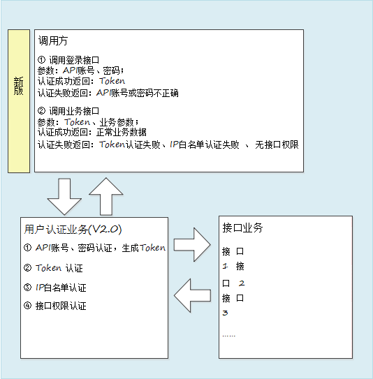

<!--
 * @Description: 
 * @Author: xyh
 * @Date: 2020-05-14 12:29:52
 * @LastEditors: Please set LastEditors
 * @LastEditTime: 2020-05-20 13:04:11
 -->
# 天巡开放平台

## 演示Demo
- [在线访问](./index.html)

- 资源URL地址： [http://smartsafety.aidriving.com](#)

## 概述
天巡开放平台整合了道路货运行业内重型载货汽车的全量数据。在基于 500 万+重载货运车辆的大数据基础上、经过数据清洗、整合、处理后，开放提供多维度、多层次的车辆数据供用户在道路货运相关业务场景中使用。   
天巡开放平台 API 服务目前已为物流、金融、交通、保险、政府、车厂六大领域全面放开数据，开放的接口覆盖：位置信息、报警数据、信息验证、事件通知、辅助工具六大类。

## 适用对象
本文档适用于期望应用智运数据开放平台做各种数据业务应用的相关工作人员。

## 
术语和定义
- `https`
HTTPS（全称：Hyper Text Transfer Protocol over Secure Socket Layer），是以安全为目标的 HTTP 通道，简单讲是 HTTP 的安全版。即 HTTP 下加入 SSL 层，HTTPS 的安全基础是SSL，因此加密的详细内容就需要 SSL。 它是一个 URI scheme（抽象标识符体系），句法类同http:体系。用于安全的 HTTP 数据传输。
- `SDK`（软件开发工具包）
软件开发工具包（外语首字母缩写：SDK、外语全称：Software Development Kit）一般都是一些软件工程师为特定的软件包、软件框架、硬件平台、操作系统等建立应用软件时的开发工具的集合。

## 接口联调流程
API 接口通过 https 方式对外提供接口服务，遵循 API 接口规范，发送 https 请求，支持POST，数据交换接口将验证 API 用户的合法性和安全性，然后提供接口服务，接口数据采用UTF-8 格式编码。
1. `获取账密`
由你方商务人员向我方商务人员发起申请，申请成功后将为您提供调用接口所需的 `API 账号`、`密码`、`私钥`及`客户端 ID `信息。 
2. `编写接口`  
编写调用 API 接口的客户端代码，按照接口定义的 https 调用方式及传输转换后的参数进行调用，调用示例代码详见附录 B 及调用示例工程。 
3. `联调测试`  
请根据文档中的示例参数或示例程序进行联调，联调环境为非正式数据，需使用我方指定的参数进行联调。接口调用成功且返回数据可正常解析后，表示联调成功。

## 技术要求
### 接口调用方式
API 接口通过 https 方式对外提供接口服务，遵循 API 接口规范，发送 https 请求，支持POST，数据交换接口将验证 API 用户的合法性和安全性，然后提供接口服务，接口数据采用UTF-8 格式编码。


## aidrving.js
### 兼容性

`aidrving.js`不支持IE浏览器，因`aidrving.js`使用了`ES6`的特性，推荐使用[Chrome浏览器](https://v.car900.com/resource/ChromeSetup.exe)

### css引入

- 下载直接引入：
``` html
    <link rel="stylesheet" href="./css/iconfont.css">
    <link rel="stylesheet" href="./css/aidriving_video.css">
```
需要将css文件夹下的 名为`iconfont`的6个文件引入到`iconfont.css`同级目录下

### html
- 创建一个div，class名为 `video-content`

``` html
    <div class='video-content'></div>
```

### JS引入

- 下载直接引入：
``` html
    <script src='./aidriving_video.js'></script>
```


## 接口说明
### aidriving_video.js

### aidrivingPlayer

对象属性：
- [config](#config)

对象方法：
- [init()](#)
- [showTip()](#)
- [cleanVideo()](#)
- [openAutoClose()](#)
- [updateAutoCloseTime()](#)
- [playAll()](#)
- [destroyAll()](#)
- [updatePassageway()](#)

根据`config`创建`byskplayer`实例

### aidrivingPlayer.init(config)
视频初始化
``` js
    aidrivingPlayer.init(config)
```

**config**

| 参数名称 |  类型 | 简介 |
| ------- | ----- | ---- |
| `sim` | `string` | SIM卡号 |
| `sessionId` | `string` | session |
| `token` | `string` | token |
| `playType` | `string` | 播放类型 `broadcast`：视频直播， `playback` : 视频回放 |
| `passageway`| `number` | 通道数 最大16，最小1|
| `streamType`| `number` | 码流类型0：主码流，1：子码流 默认1 |
| `mediaType`| `number` | 通道号 |
| `storeType`| `number` | 存储器类型0：所有存储器，1：主存储器，2：灾备存储器默认0 |
| `dataType`| `number` | 媒体类型0：音视频，1：音频，2：视频，3：视频或音视频 |
| `playBackType`| `number` | 回放类型，0正常回放，1快进回放，2快退回放，默认0 |
| `times`| `number` | 快进或快退方式，回放方式为1或者2的时候有效，否则置0，0.无效，1.一倍，2.两倍，3.四倍，4.八倍，5.十六倍，默认0 |
| `startTime`| `string` | 请求历史视频开始时间 |
| `endTime`| `string` | 请求历史视频结束时间 |
| `playStartTime`| `string` | 回放播放开始时间 |
| `playEndTime`| `string` | 回放播放结束时间 |
| `channelId`| `number` | 通道号 |
| `serverUrl`| `string` | 服务地址 |
| `getVideoUrl`| `string` | 获取视频地址请求 |
| `stopVideoUrl`| `string` | 停止视频请求 |
| `bateUrl`| `string` | 直播心跳 |
| `getVehicleNoUrl`| `string` | 获取车牌号 |
| `playbackTimelineUrl`| `string` | 下发历史视频资源列表查询指令 |
| `playbackUrl`| `string` | 下发远程回放指令 |

### aidrivingPlayer.showTip(msg)
文本提示
``` js
    const msg = 'tip!'
    aidrivingPlayer.showTip(msg)
```
| 参数名称 |  类型 | 简介 |
| ------- | ----- | ---- |
| `msg` | `string` | 提示信息 |

### aidrivingPlayer.cleanVideo()
清空`video-content` 下的视频元素
``` js
    aidrivingPlayer.cleanVideo()
```
### aidrivingPlayer.openAutoClose()
开启自动关闭视频
``` js
    aidrivingPlayer.openAutoClose()
```
### aidrivingPlayer.updateAutoCloseTime(time)
更新自动关闭视频时间
``` js
    const time = 5 // 单位分钟
    aidrivingPlayer.updateAutoCloseTime(time)
```
| 参数名称 |  类型 | 简介 |
| ------- | ----- | ---- |
| `time` | `number` | 时间（分钟） |

### aidrivingPlayer.playAll()
播放全部视频
``` js
    aidrivingPlayer.playAll()
```
### aidrivingPlayer.destroyAll()
销毁全部视频
``` js
    aidrivingPlayer.destroyAll()
```
### aidrivingPlayer.updatePassageway(number)
更换通道数
``` js
    const number = 4
    aidrivingPlayer.updatePassageway(number)
```
| 参数名称 |  类型 | 简介 |
| ------- | ----- | ---- |
| `number` | `number` | 通道数 |